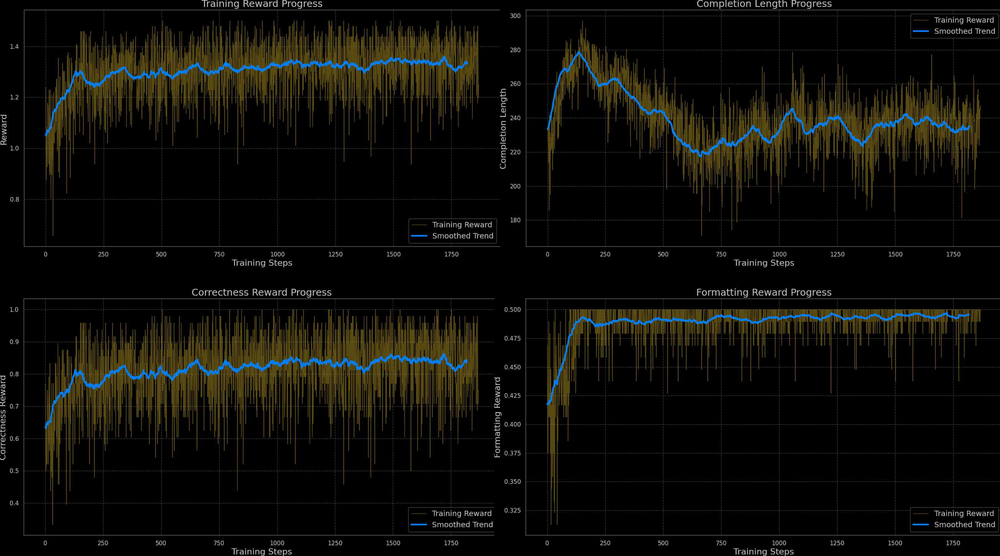

## GSM8K-RLVR: Reinforcement Learning from Verifiable Rewards for Base Models

This repository explores applying the Reinforcement Learning from Verifiable Rewards (RLVR) concept, as proposed in the Tulu3 paper ("Pushing Frontiers in Open Language Model Post-Training") and inspired by DeepSeek R1, to enhance the performance of base language models on the GSM8K math problem-solving dataset.

### Key Features:

- Base Model Focus: Targets improving base models without reliance on pre-trained reward models.

- Few-Shot Prompting: Leverages few-shot examples within each model's input to establish the desired data pattern and facilitate RL learning.

- Simplified Prompt Format: Omits explicit `<think>` and `<answer>` tags, keeping completions straightforward.

- Dual Reward System: Employs two reward functions:

    - Correctness: Rewards accurate answers to GSM8K problems.

    -  Format Adherence: Incentivizes outputting the final answer in the specific `#### The final answer is {number}` format.

### Goal:

To adapt and refine base models for better mathematical reasoning and structured output through RLVR, using only GSM8K data and few-shot prompting.

### Results

This section summarizes the performance improvements achieved by RL fine-tuning the `Qwen/Qwen2.5-Math-1.5B` model using RLVR and GRPO on the GSM8K benchmark.

**Performance Summary (8-shots Evaluation):**

`Qwen/Qwen2.5-Math-1.5B`:

| Metric               | Baseline (Paper) | Baseline (Mine) | After RLVR+GRPO | Improvement |
|-----------------------|------------------|-----------------|-----------------|-------------|
| GSM8K 8-shot Accuracy| 76.8             | 70.66           | 77.33           | +6.67       |

`Qwen/Qwen2.5-0.5B`:

| Metric               | Baseline (Paper) | Baseline (Mine) | After RLVR+GRPO | Improvement |
|-----------------------|------------------|-----------------|-----------------|-------------|
| GSM8K 8-shot Accuracy| 41.6             | 32.60           | 46.10           | +13.5       |

> **Note:** While these results are impressive, I think a fairer comparison would be to do SFT on GSM8K  on top of both the base model and RL fine-tuned version and evaluate the models in a zero-shot approach.

> **Note:** I also tried Baseline+SFT with a language-modeling loss function on completions, but I consistently observed worse performance compared to few-shot settings on Baseline. However, Baseline+RLVR performed well even with a 1-shot example. The only scenario where SFT outperformed RLVR was in the zero-shot setting, where RLVR achieved 0.00% due to improper formatting.

One interesting observation arose from an error in passing arguments. I noticed that loading the LoRA adapter trained on `Qwen/Qwen2.5-Math-1.5B` also improved the performance of `Qwen/Qwen2.5-1.5B` on GSM8K, increasing the score from 58.23% to 64.82%.

**Key Details:**

*   The model was fine-tuned for two epochs using a reward function that incorporates:
    *   **Correctness:** 1 for correct answers, 0 for incorrect.
    *   **Formatting:** 0.5 for properly formatted answers, 0 otherwise.
*   "Baseline (Mine)" refers to the model's performance on my implementation *before* RL fine-tuning.

### Implementation Notes and Considerations

This section outlines key details regarding my implementation and potential factors influencing the reported results.

*   **Resource Constraints:** Due to a 24GB VRAM limitation, I had to restrict:
    *   **Completion Length:** The maximum generated sequence length during RL fine-tuning was capped at 300 tokens.
    *   **Few-Shot Examples:**  During RL fine-tuning, I limited the number of few-shot examples to two and tokens to 256.
    *  **Impact:** These limitations may affect the model's ability to solve more complex problems requiring longer explanations. I believe that removing these constraints could lead to a further improvement in results.
*   **Dataset Ordering Bias:**  There is an observed trend within the GSM8K dataset where early samples may be more challenging. Therefore, without shuffling the dataset, the reported reward increase plots may appear overly optimistic due to learning on harder examples earlier in training. Be cautious when interpreting results if the dataset is not shuffled.

### Future Work

- [x] Evaluate RL fine-tuning on `Qwen/Qwen2.5-0.5B` to assess scalability.
- [x] Extend fine-tuning to models generating code with Python interpreter execution on GSM8K.
- [ ] Share models on HuggingFace.